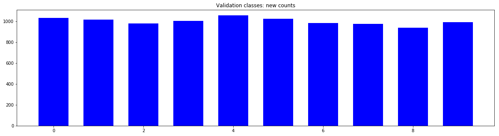

# **Traffic Sign Recognition**

This is a writeup for the [Traffic sign classifier project](https://github.com/udacity/CarND-Traffic-Sign-Classifier-Project) in the Udactiy Self Driving Car nanodegree. 

[Project file](Traffic_Sign_Classifier.ipynb) ([html](report/Traffic_Sign_Classifier.html)/[md](report/Traffic_Sign_Classifier.md))

## Rubric Points

### Data Set Summary & Exploration

#### 1. Basic summary of the data set.

I used the numpy library to calculate summary statistics of the traffic
signs data set:

* The size of training set is 34799
* The size of the validation set is 4410
* The size of test set is 12630
* The shape of a traffic sign image is (32,32,3)
* The number of unique classes/labels in the data set is 43

#### 2. Exploratory visualization of the dataset.

#####  Examples of all classes in the dataset

Below are all the classes in the dataset with a visual example pulled from the training set.

#####  Distribution of examples per class in the training set

The below graph gives more insight in the distribution of the examples over the classes in the training set. The distribution is far from even.

#####  Distribution of examples per class in the validation set

The validation dataset shows the same distribution.

### Design and Test of the Model Architecture

#### 1. Data pre-processing and augmentation

As a first step, I decided to convert the images to grayscale because color information did not add much to classication accuracy. Added bonus is that training is faster with grayscale images.

Here is an example of a traffic sign image before and after grayscaling.

As a last step, I normalized the image data because it helps in avoiding local optima and facilitates faster convergence. I decided to generate additional data because the dataset provided is unbalanced in the number of examples per class. Also, 
using slightly distorted versions of the original images helps prevent overfitting and leads to a better generalization.

To add more data to the the data set, I first combined the training and validation set and shuffled it. Then for each image in that set I 
repeatedly added a slightly distorted version to supplement the examples for that class up to a pre-set limit of 4000 examples per class. The transformations applied where translation, rotation, shearing and zooming with random parameters in a reasonable range 
(eg, leading to results as might actually be seen in real life).

Here is an example of an original image and and each transformation:

| Original | Translated | Rotated |  Sheared | Zoomed |  
| --- | --- | --- | --- | --- |
|  |  |  |  |  |

After augmenting the data, I split it back up into a training and validation set with a divison of 80/20. The difference between the original data set and the 
augmented data set is that the classes are much more balanced. (See the two graphs below in comparison to the original graphs). 
The resulting dataset consists of 172,000 examples in total.

#### 2. Final Architecture

My final model consisted of the following layers:

| Layer         		|     Description	        					| 
|:---------------------:|:---------------------------------------------:| 
| Input         		| 32x32x1 grayscale image   					| 
| **Convolution** 5x5   | 1x1 stride, same padding, outputs 28x28x6 	|
| RELU					|												|
| Max pooling	      	| 2x2 stride, outputs 14x14x6 				    |
|                       |                                               |
| **Convolution** 5x5	| 1x1 stride, outputs 10x10x16                  |
| RELU                  |                                               |
| Max pooling	      	| 2x2 stride,  outputs 5x5x16 				    |
|                       |                                               |
| Flatten               | Outputs 400                                   |
|                       |                                               |
| **Fully connected**	| Outputs 200        							|
| RELU                  |                                               |
| Dropout               | 0.5 keep during training                      |
|                       |                                               |
| **Fully connected**	| Outputs 120        							|
| RELU                  |                                               |
| Dropout               | 0.5 keep during training                      |
|                       |                                               |
| **Fully connected**	| Outputs 84        							|
| RELU                  |                                               |
| Dropout               | 0.5 keep during training                      |
|                       |                                               |
| **Fully connected**	| Outputs 43       							    |
|                       |                                               |
| Softmax				|        									    |
 

#### 3. Model training

To train the model, I used the Adam optimizer a batch size of `128` and `60` epochs. The following hyper-parameters were set:

- learning rate: `0.0005`
- dropout keep probability: `0.5`
- beta for L2 regularization: `0.0001` 

To ensure the best possible model is choosen, the highest scoring model (accuracy on the validation set) was saved. 
The number of epochs were sufficient between 40 and 60 and raising it did not lead to further gains. Lowering the learning rate ensured that the optimizer converged.
The beta for L2 regularization had to be set pretty low otherwise the training and validation accuracy would decrease. Dropout between 0.5 and 0.7 was equally good.

#### 4. Approach

My final model results were:
* training set accuracy of **0.995%**
* validation set accuracy of **0.988%** 
* test set accuracy of **0.945%**

I started out by using the LeNet architecture as a baseline as it is proven to work well with recognition of a limited set of classes. 
Initial tweaks only included setting the number of output logits to match the 
classes in the dataset (43) and setting the input dimensions to allow for 32x32 grayscale images.

To be able to iterate quickly iterate, at first I kept the number of epochs low and added a simple graph of the training and validation accuracy offset to the number of epochs (as shown above).
After that I did a first round of tweaking of the hyper-parameters and normalised the data to get the best result from the existing data and architecture. It was clear though that the model was not performing well, 
and was underfitting as the training and validation error remained high.

To ensure the model was no longer underfitting, I experimented with adding more parameters to the model. At first I just widened the first fully connected layer, but lateron added
an additional layer to get more depth as well. This in turn resulted in the model overfitting, with high training accuracy and low validation accuracy. To counter the overfitting, I took
a couple of steps; 
- First I added dropout. Initially to all layers, but I soon discovered that it had an adverse effect when applied to the convolutional layers, so in the final design, I only applied
dropout to the fully connected layers.
- I then augmented the data to ensure that the test set was balanced and had enough variation so that the model didn't just learn the features of the training set.
- I added L2 regularization to further prevent overfitting. Initially starting out with a `beta` that was a factor `10` too large and negatively impacting the performance of the model
Using a model with, maybe, too many parameters and using these techniques combat overfitting has lead to a pretty high test accuracy and a more generalizable model.

I then returned to tweaking the hyper-parameters, using more epochs to train and validate. In the end I added early termination by only saving the model with the highest validation accuracy.

The end result has a high training and validation accuracy and the test accuracy seems to indicate it generalizes well. 
 

### Test a Model on New Images

#### 1. Choosen images

Here are ten German traffic signs that I found on the web (first hits on google):

| Image | Description |
| --- | --- |
|  | Slightly tilted signtj|
|  | Strong sunset in background |
|  | Cloudy background, low contrast |
|  | Clear skies |
|  | Shrubbery in background |
|  | Slightly odd angle |
|  | Beat up sign, different objects in the background |
|  | Edge of sign out of frame |
|  | Zoomed out |
|  | Clear example, non-uniform background |

They are all pretty clear examples with slight variations in zoom, background and quality.

#### 2. Model's predictions

The following images show the input image side by side with the prediction (and a visual example thereof). The model has a score of `100%` as it recognizes all images correctly. Compared to the accuracy on the test set (`~95%`),
the chosen images are very well defined.

#### 3. Model's top 5 softmax score per image

I've plotted out the resulting scores per image in the graphs below. The model not only recognizes all images correctly, but does so with a high confidence. The correct class always has 
a confidence of `> 99%`.

For the second image ... 

### The Neural Network Visualized 

Below is a visualization of the first two layers in the model, the convolutional layers, for the given input image. The first layer pretty clearly visualizes the characteristics used 
to identify the sign, the outlines and letters seem to be the main contributors. Lower layers quickly become more abstract.

**The input image**

**The result of the first convolution:**

**The result after RELU activation**

**The result after max pooling activation**

**The second of the first convolution:**

**The result after RELU activation**

**The result after max pooling activation**

