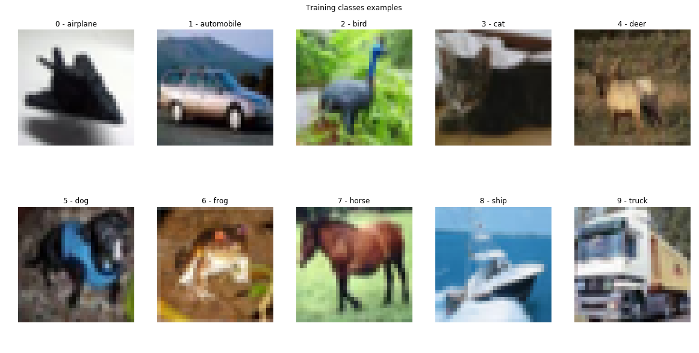
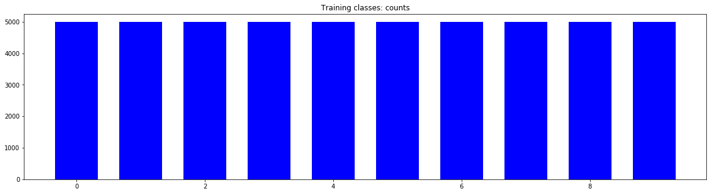
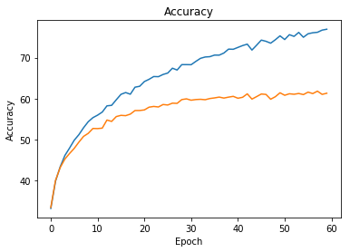

# Self-Driving Car Engineer Nanodegree

## Deep Learning

## Project: Build a Traffic Sign Recognition Classifier

In this notebook, a template is provided for you to implement your functionality in stages, which is required to successfully complete this project. If additional code is required that cannot be included in the notebook, be sure that the Python code is successfully imported and included in your submission if necessary. 

> **Note**: Once you have completed all of the code implementations, you need to finalize your work by exporting the iPython Notebook as an HTML document. Before exporting the notebook to html, all of the code cells need to have been run so that reviewers can see the final implementation and output. You can then export the notebook by using the menu above and navigating to  \n",
    "**File -> Download as -> HTML (.html)**. Include the finished document along with this notebook as your submission. 

In addition to implementing code, there is a writeup to complete. The writeup should be completed in a separate file, which can be either a markdown file or a pdf document. There is a [write up template](https://github.com/udacity/CarND-Traffic-Sign-Classifier-Project/blob/master/writeup_template.md) that can be used to guide the writing process. Completing the code template and writeup template will cover all of the [rubric points](https://review.udacity.com/#!/rubrics/481/view) for this project.

The [rubric](https://review.udacity.com/#!/rubrics/481/view) contains "Stand Out Suggestions" for enhancing the project beyond the minimum requirements. The stand out suggestions are optional. If you decide to pursue the "stand out suggestions", you can include the code in this Ipython notebook and also discuss the results in the writeup file.


>**Note:** Code and Markdown cells can be executed using the **Shift + Enter** keyboard shortcut. In addition, Markdown cells can be edited by typically double-clicking the cell to enter edit mode.

---
## Step 0: Load The Data


```python
# Load pickled data
import pickle
import csv
import os

from keras.datasets import cifar10
(X_train, y_train), (X_test, y_test) = cifar10.load_data()
# y_train.shape is 2d, (50000, 1). While Keras is smart enough to handle this
# it's a good idea to flatten the array.
y_train = y_train.reshape(-1)
y_test = y_test.reshape(-1)

# load label names to use in prediction results
label_list_path = 'datasets/cifar-10-batches-py/batches.meta'

keras_dir = os.path.expanduser(os.path.join('~', '.keras'))
datadir_base = os.path.expanduser(keras_dir)
if not os.access(datadir_base, os.W_OK):
    datadir_base = os.spath.join('/tmp', '.keras')
label_list_path = os.path.join(datadir_base, label_list_path)

with open(label_list_path, mode='rb') as f:
    labels = pickle.load(f)['label_names']
print("Loaded label names from %s" % label_list_path)
```

    Using TensorFlow backend.


    Downloading data from http://www.cs.toronto.edu/~kriz/cifar-10-python.tar.gz
    Untaring file...
    Loaded label names from /home/carnd/.keras/datasets/cifar-10-batches-py/batches.meta


---

## Step 1: Dataset Summary & Exploration

The pickled data is a dictionary with 4 key/value pairs:

- `'features'` is a 4D array containing raw pixel data of the traffic sign images, (num examples, width, height, channels).
- `'labels'` is a 1D array containing the label/class id of the traffic sign. The file `signnames.csv` contains id -> name mappings for each id.
- `'sizes'` is a list containing tuples, (width, height) representing the original width and height the image.
- `'coords'` is a list containing tuples, (x1, y1, x2, y2) representing coordinates of a bounding box around the sign in the image. **THESE COORDINATES ASSUME THE ORIGINAL IMAGE. THE PICKLED DATA CONTAINS RESIZED VERSIONS (32 by 32) OF THESE IMAGES**

Complete the basic data summary below. Use python, numpy and/or pandas methods to calculate the data summary rather than hard coding the results. For example, the [pandas shape method](http://pandas.pydata.org/pandas-docs/stable/generated/pandas.DataFrame.shape.html) might be useful for calculating some of the summary results. 

### Provide a Basic Summary of the Data Set Using Python, Numpy and/or Pandas


```python
### Replace each question mark with the appropriate value. 
### Use python, pandas or numpy methods rather than hard coding the results

import numpy as np

# TODO: Number of training examples
n_train = X_train.shape[0]

# TODO: Number of testing examples.
n_test = X_test.shape[0]

# TODO: How many unique classes/labels there are in the dataset.
n_classes = len(np.unique(y_train))

print("Number of training examples =", n_train)
print("Number of testing examples =", n_test)
print("Number of classes =", n_classes)
```

    Number of training examples = 50000
    Number of testing examples = 10000
    Number of classes = 10


### Include an exploratory visualization of the dataset

Visualize the German Traffic Signs Dataset using the pickled file(s). This is open ended, suggestions include: plotting traffic sign images, plotting the count of each sign, etc. 

The [Matplotlib](http://matplotlib.org/) [examples](http://matplotlib.org/examples/index.html) and [gallery](http://matplotlib.org/gallery.html) pages are a great resource for doing visualizations in Python.

**NOTE:** It's recommended you start with something simple first. If you wish to do more, come back to it after you've completed the rest of the sections. It can be interesting to look at the distribution of classes in the training, validation and test set. Is the distribution the same? Are there more examples of some classes than others?


```python
### Data exploration visualization code goes here.
### Feel free to use as many code cells as needed.
import matplotlib.pyplot as plt
import numpy as np
# Visualizations will be shown in the notebook.
%matplotlib inline

def get_examples_per_class():
    u, indices = np.unique(y_train, return_index=True)
    examples =[]
    
    for i in range(1, len(indices) + 1):
        img = X_train[indices[i - 1]]
        label = y_train[indices[i - 1]]
        label_string = labels[label]
        examples.append([img, label, label_string])
    
    return examples

def show_class_examples(examples_per_class):
    #Plot an example for each class
    columns = 5
    rows = np.ceil(len(examples_per_class)/columns)

    fig = plt.figure(figsize = (columns * 4, rows * 2));
    plt.title("Training classes examples")
    plt.axis('off')
    plt.subplots_adjust(top=2)
    for i in range(0, len(examples_per_class)):
        example = examples_per_class[i]
        img = example[0]
        label = example[1]
        label_string = example[2]
        ax = fig.add_subplot(rows, columns, i + 1)
        plt.title("{0} - {1}".format(label, label_string))
        ax.imshow(img) if img.shape[2] == 3 else ax.imshow(img[:,:,0], cmap='gray')
        ax.axis('off')
#     fig.tight_layout()
    
        
def plot_examples_per_class(y, title):
    fig = plt.figure(figsize = (20,5));
    plt.title(title)
    unique_elements, counts_elements = np.unique(y, return_counts=True)
    train_examples_per_class = list(zip(unique_elements, counts_elements))
    width = 1/1.5
    x = unique_elements
    y = counts_elements
    plt.bar(x, y, width, color="blue")
        
examples_per_class = get_examples_per_class()
show_class_examples(examples_per_class)
plot_examples_per_class(y_train, "Training classes: counts")
```








----

## Step 2: Design and Test a Model Architecture

Design and implement a deep learning model that learns to recognize traffic signs. Train and test your model on the [German Traffic Sign Dataset](http://benchmark.ini.rub.de/?section=gtsrb&subsection=dataset).

The LeNet-5 implementation shown in the [classroom](https://classroom.udacity.com/nanodegrees/nd013/parts/fbf77062-5703-404e-b60c-95b78b2f3f9e/modules/6df7ae49-c61c-4bb2-a23e-6527e69209ec/lessons/601ae704-1035-4287-8b11-e2c2716217ad/concepts/d4aca031-508f-4e0b-b493-e7b706120f81) at the end of the CNN lesson is a solid starting point. You'll have to change the number of classes and possibly the preprocessing, but aside from that it's plug and play! 

With the LeNet-5 solution from the lecture, you should expect a validation set accuracy of about 0.89. To meet specifications, the validation set accuracy will need to be at least 0.93. It is possible to get an even higher accuracy, but 0.93 is the minimum for a successful project submission. 

There are various aspects to consider when thinking about this problem:

- Neural network architecture (is the network over or underfitting?)
- Play around preprocessing techniques (normalization, rgb to grayscale, etc)
- Number of examples per label (some have more than others).
- Generate fake data.

Here is an example of a [published baseline model on this problem](http://yann.lecun.com/exdb/publis/pdf/sermanet-ijcnn-11.pdf). It's not required to be familiar with the approach used in the paper but, it's good practice to try to read papers like these.

### Pre-process the Data Set (normalization, grayscale, etc.)

Minimally, the image data should be normalized so that the data has mean zero and equal variance. For image data, `(pixel - 128)/ 128` is a quick way to approximately normalize the data and can be used in this project. 

Other pre-processing steps are optional. You can try different techniques to see if it improves performance. 

Use the code cell (or multiple code cells, if necessary) to implement the first step of your project.


```python
# Generate some data
import sys
import random
import math
import scipy
import numpy as np
from skimage.transform import warp, AffineTransform

# def rotate_image(image, angle=10):
#     return scipy.ndimage.rotate(image, random.randint(-angle,angle), reshape=False)

# def shear_image(image):
#     shear = random.randint(1,2) / 10
#     tform = AffineTransform(shear=shear)
#     return warp(image, tform, preserve_range=True).astype(int)

# def scale_image(image):
#     sx = 1 - random.randint(1,2) / 10
#     sy = 1 - random.randint(1,2) / 10
#     tform = AffineTransform(scale=(sx, sy))
#     return warp(image, tform, preserve_range=True).astype(int)

# def translate_image(image):
#     tx = random.randint(0,3)
#     ty = random.randint(0,3)
#     tform = AffineTransform(translation=(tx, ty))
#     return warp(image, tform, preserve_range=True).astype(int)

# def transform_image(image):
#     transformations = {
#         0: rotate_image,
#         1: shear_image,
#         2: scale_image,
#         3: translate_image
#     }
#     return transformations[random.randint(0, len(transformations) - 1)](image)

# # level the numbers per class
# new_trainX = []
# new_trainY = []
# target_size = 4000
# max_size = target_size

# def extend_image_set(samples):
#     expanded = []
#     expanded.extend(samples)

#     sample_size = len(samples)
#     new_size = sample_size
#     while True:
#         for image in samples:
#             expanded.append(transform_image(image))
#             new_size += 1
#             if  new_size >= target_size:
#                 return expanded

# sys.stdout.write("Processing images for class: ")

# # Concatenate train and validation sets
# X_train = np.concatenate((X_train, X_valid))
# y_train = np.concatenate((y_train, y_valid))

# # Augment data
# for i in range(0,43):
#     sys.stdout.write("{0}..".format(i))
#     samples = X_train[np.where(y_train == i)]
#     sample_size = samples.shape[0]
#     if (sample_size < target_size):
#         samples = np.array(extend_image_set(samples))
#     elif (sample_size > max_size):
#         samples = samples[0:max_size]
#     new_trainY.append(np.full((samples.shape[0]), i).flatten())
#     new_trainX.append(samples)
    
# sys.stdout.write('done\n')
# sys.stdout.flush()

# new_sample_length = sum([len(x) for x in new_trainX])
# y_train = np.concatenate(new_trainY)
# X_train = np.concatenate(new_trainX)

# Split train and validation sets
from sklearn.utils import shuffle
from sklearn.model_selection import train_test_split

X_train, y_train = shuffle(X_train, y_train)
X_train, X_valid, y_train, y_valid = train_test_split(X_train, y_train, test_size=0.2, random_state=0)

# Plot new sets
plot_examples_per_class(y_train, "Training classes: new counts")
plot_examples_per_class(y_valid, "Validation classes: new counts")
```


```python
### Preprocess the data here. It is required to normalize the data. Other preprocessing steps could include 
### converting to grayscale, etc.
### Feel free to use as many code cells as needed.

import numpy as np

def toFloat(X):
    return X.astype(np.float32)

def normalise(X):
    return (X  - 128) / 128

def grayscale(X):
    return np.reshape(np.mean(X, axis=3), (X.shape[0], X.shape[1], X.shape[2], 1))

def preprocess(X):
    return normalise(grayscale(toFloat(X)))

X_train, X_valid, X_test = [preprocess(X) for X in [X_train, X_valid, X_test]]

show_class_examples(get_examples_per_class())
```


### Model Architecture


```python
### Define your architecture here.
### Feel free to use as many code cells as needed.
import tensorflow as tf
from tensorflow.contrib.layers import flatten

def model(x, keep_prob):    
    # Hyperparameters
    mu = 0
    sigma = 0.1

    # Layer 1: Convolutional. Input = 32x32x3. Output = 28x28x6.
    conv1_W = tf.Variable(tf.truncated_normal(shape=(5, 5, 1, 6), mean = mu, stddev = sigma))
    conv1_b = tf.Variable(tf.zeros(6))
    conv1 = tf.nn.conv2d(x, conv1_W, strides=[1, 1, 1, 1], padding='VALID', name='conv1_0') + conv1_b
    conv1 = tf.nn.relu(conv1, name='conv1_1')
#     conv1 = tf.nn.dropout(conv1, keep_prob) Adding dropout to the convolutional layers is not helpful
    # Pooling. Input = 28x28x6. Output = 14x14x6.
    conv1 = tf.nn.max_pool(conv1, ksize=[1, 2, 2, 1], strides=[1, 2, 2, 1], padding='VALID', name='conv1_2')

    # Layer 2: Convolutional. Output = 10x10x16.
    conv2_W = tf.Variable(tf.truncated_normal(shape=(5, 5, 6, 16), mean = mu, stddev = sigma))
    conv2_b = tf.Variable(tf.zeros(16))
    conv2 = tf.nn.conv2d(conv1, conv2_W, strides=[1, 1, 1, 1], padding='VALID', name='conv2_0') + conv2_b
    conv2 = tf.nn.relu(conv2, name='conv2_1')
    # Pooling. Input = 10x10x16. Output = 5x5x16.
    conv2 = tf.nn.max_pool(conv2, ksize=[1, 2, 2, 1], strides=[1, 2, 2, 1], padding='VALID', name='conv2_2')

    # Flatten. Input = 5x5x16. Output = 400.
    fc0 = flatten(conv2)

    # Layer 3: Fully Connected. Input = 400. Output = 200.
    fc1_W = tf.Variable(tf.truncated_normal(shape=(400, 200), mean = mu, stddev = sigma))
    fc1_b = tf.Variable(tf.zeros(200))
    fc1 = tf.matmul(fc0, fc1_W) + fc1_b
    fc1 = tf.nn.relu(fc1, name='fc1')
    fc1 = tf.nn.dropout(fc1, keep_prob)

    # Layer 4: Fully Connected. Input = 200. Output = 120.
    fc2_W  = tf.Variable(tf.truncated_normal(shape=(200, 120), mean = mu, stddev = sigma))
    fc2_b  = tf.Variable(tf.zeros(120))
    fc2 = tf.matmul(fc1, fc2_W) + fc2_b
    fc2 = tf.nn.relu(fc2, name='fc2')
    fc2 = tf.nn.dropout(fc2, keep_prob)
    
    # Layer 5: Fully Connected. Input = 200. Output = 84.
    fc3_W  = tf.Variable(tf.truncated_normal(shape=(120, 84), mean = mu, stddev = sigma))
    fc3_b  = tf.Variable(tf.zeros(84))
    fc3 = tf.matmul(fc2, fc3_W) + fc3_b
    fc3 = tf.nn.relu(fc3, name='fc3')
    fc3 = tf.nn.dropout(fc3, keep_prob)

    # Layer 6: Fully Connected. Input = 84. Output = 10.
    fc4_W = tf.Variable(tf.truncated_normal(shape=(84, 10), mean = mu, stddev = sigma))
    fc4_b = tf.Variable(tf.zeros(10))
    logits = tf.matmul(fc3, fc4_W) + fc4_b

    return logits, tf.nn.l2_loss(conv1_W) + tf.nn.l2_loss(conv2_W) + tf.nn.l2_loss(fc1_W) + tf.nn.l2_loss(fc2_W) + tf.nn.l2_loss(fc3_W) + tf.nn.l2_loss(fc4_W)
```

### Train, Validate and Test the Model

A validation set can be used to assess how well the model is performing. A low accuracy on the training and validation
sets imply underfitting. A high accuracy on the training set but low accuracy on the validation set implies overfitting.


```python
### Train your model here.
### Calculate and report the accuracy on the training and validation set.
### Once a final model architecture is selected, 
### the accuracy on the test set should be calculated and reported as well.
### Feel free to use as many code cells as needed.

import tensorflow as tf
from sklearn.utils import shuffle

# EPOCHS = 10
# BATCH_SIZE = 128
EPOCHS = 60
BATCH_SIZE = 128
KEEP_PROB = 0.5 # Keep probability for dropout <- todo lower
BETA = 0.0001 # Beta for L2 regularization <- todo lower factor 10

x = tf.placeholder(tf.float32, (None, 32, 32, 1))
y = tf.placeholder(tf.int32, (None))
keep_prob = tf.placeholder(tf.float32)
one_hot_y = tf.one_hot(y, 10)

# Training pipeline
rate = 0.0005
#rate = 0.001

logits, reg = model(x, keep_prob)
cross_entropy = tf.nn.softmax_cross_entropy_with_logits(labels=one_hot_y, logits=logits)
loss_operation = tf.reduce_mean(cross_entropy) + reg * BETA
optimizer = tf.train.AdamOptimizer(learning_rate = rate)
training_operation = optimizer.minimize(loss_operation)

# Model evaluation
correct_prediction = tf.equal(tf.argmax(logits, 1), tf.argmax(one_hot_y, 1))
accuracy_operation = tf.reduce_mean(tf.cast(correct_prediction, tf.float32))
saver = tf.train.Saver()

def evaluate(X_data, y_data):
    num_examples = len(X_data)
    total_accuracy = 0
    sess = tf.get_default_session()
    for offset in range(0, num_examples, BATCH_SIZE):
        batch_x, batch_y = X_data[offset:offset+BATCH_SIZE], y_data[offset:offset+BATCH_SIZE]
        accuracy = sess.run(accuracy_operation, feed_dict={x: batch_x, y: batch_y, keep_prob: 1})
        total_accuracy += (accuracy * len(batch_x))
    return total_accuracy / num_examples

# Train
accuracy = {'training': [], 'validation':[]}
    
with tf.Session() as sess:
    sess.run(tf.global_variables_initializer())
    num_examples = len(X_train)
    
    print("Training...")
    print()
    highest_accuracy = 0
    for i in range(EPOCHS):
        print("EPOCH {}".format(i+1))
        print("Training...")
        X_train, y_train = shuffle(X_train, y_train)
        for offset in range(0, num_examples, BATCH_SIZE):
            end = offset + BATCH_SIZE
            batch_x, batch_y = X_train[offset:end], y_train[offset:end]
            sess.run(training_operation, feed_dict={x: batch_x, y: batch_y, keep_prob: KEEP_PROB})
            
        print("Evaluating...".format(i+1))
        training_accuracy = evaluate(X_train, y_train)
        validation_accuracy = evaluate(X_valid, y_valid)
        accuracy["training"].append(training_accuracy);
        accuracy["validation"].append(validation_accuracy);
        print("Training Accuracy = {:.3f}".format(training_accuracy))
        print("Validation Accuracy = {:.3f}".format(validation_accuracy))
        
        # Only save the highest accuracy
        if validation_accuracy > highest_accuracy:
            highest_accuracy = validation_accuracy
            
            saver.save(sess, './model')
            print("Model saved")
            
        print()


```

    Training...
    
    EPOCH 1
    Training...
    Evaluating...
    Training Accuracy = 0.333
    Validation Accuracy = 0.335
    Model saved
    
    EPOCH 2
    Training...
    Evaluating...
    Training Accuracy = 0.399
    Validation Accuracy = 0.401
    Model saved
    
    EPOCH 3
    Training...
    Evaluating...
    Training Accuracy = 0.434
    Validation Accuracy = 0.432
    Model saved
    
    EPOCH 4
    Training...
    Evaluating...
    Training Accuracy = 0.461
    Validation Accuracy = 0.453
    Model saved
    
    EPOCH 5
    Training...
    Evaluating...
    Training Accuracy = 0.480
    Validation Accuracy = 0.466
    Model saved
    
    EPOCH 6
    Training...
    Evaluating...
    Training Accuracy = 0.499
    Validation Accuracy = 0.479
    Model saved
    
    EPOCH 7
    Training...
    Evaluating...
    Training Accuracy = 0.512
    Validation Accuracy = 0.494
    Model saved
    
    EPOCH 8
    Training...
    Evaluating...
    Training Accuracy = 0.529
    Validation Accuracy = 0.508
    Model saved
    
    EPOCH 9
    Training...
    Evaluating...
    Training Accuracy = 0.544
    Validation Accuracy = 0.516
    Model saved
    
    EPOCH 10
    Training...
    Evaluating...
    Training Accuracy = 0.554
    Validation Accuracy = 0.527
    Model saved
    
    EPOCH 11
    Training...
    Evaluating...
    Training Accuracy = 0.560
    Validation Accuracy = 0.527
    
    EPOCH 12
    Training...
    Evaluating...
    Training Accuracy = 0.568
    Validation Accuracy = 0.528
    Model saved
    
    EPOCH 13
    Training...
    Evaluating...
    Training Accuracy = 0.583
    Validation Accuracy = 0.548
    Model saved
    
    EPOCH 14
    Training...
    Evaluating...
    Training Accuracy = 0.584
    Validation Accuracy = 0.545
    
    EPOCH 15
    Training...
    Evaluating...
    Training Accuracy = 0.598
    Validation Accuracy = 0.556
    Model saved
    
    EPOCH 16
    Training...
    Evaluating...
    Training Accuracy = 0.611
    Validation Accuracy = 0.559
    Model saved
    
    EPOCH 17
    Training...
    Evaluating...
    Training Accuracy = 0.615
    Validation Accuracy = 0.559
    
    EPOCH 18
    Training...
    Evaluating...
    Training Accuracy = 0.611
    Validation Accuracy = 0.562
    Model saved
    
    EPOCH 19
    Training...
    Evaluating...
    Training Accuracy = 0.628
    Validation Accuracy = 0.571
    Model saved
    
    EPOCH 20
    Training...
    Evaluating...
    Training Accuracy = 0.630
    Validation Accuracy = 0.571
    Model saved
    
    EPOCH 21
    Training...
    Evaluating...
    Training Accuracy = 0.642
    Validation Accuracy = 0.573
    Model saved
    
    EPOCH 22
    Training...
    Evaluating...
    Training Accuracy = 0.647
    Validation Accuracy = 0.579
    Model saved
    
    EPOCH 23
    Training...
    Evaluating...
    Training Accuracy = 0.654
    Validation Accuracy = 0.581
    Model saved
    
    EPOCH 24
    Training...
    Evaluating...
    Training Accuracy = 0.654
    Validation Accuracy = 0.580
    
    EPOCH 25
    Training...
    Evaluating...
    Training Accuracy = 0.659
    Validation Accuracy = 0.586
    Model saved
    
    EPOCH 26
    Training...
    Evaluating...
    Training Accuracy = 0.663
    Validation Accuracy = 0.585
    
    EPOCH 27
    Training...
    Evaluating...
    Training Accuracy = 0.674
    Validation Accuracy = 0.589
    Model saved
    
    EPOCH 28
    Training...
    Evaluating...
    Training Accuracy = 0.670
    Validation Accuracy = 0.589
    
    EPOCH 29
    Training...
    Evaluating...
    Training Accuracy = 0.683
    Validation Accuracy = 0.598
    Model saved
    
    EPOCH 30
    Training...
    Evaluating...
    Training Accuracy = 0.683
    Validation Accuracy = 0.600
    Model saved
    
    EPOCH 31
    Training...
    Evaluating...
    Training Accuracy = 0.683
    Validation Accuracy = 0.596
    
    EPOCH 32
    Training...
    Evaluating...
    Training Accuracy = 0.691
    Validation Accuracy = 0.598
    
    EPOCH 33
    Training...
    Evaluating...
    Training Accuracy = 0.698
    Validation Accuracy = 0.599
    
    EPOCH 34
    Training...
    Evaluating...
    Training Accuracy = 0.702
    Validation Accuracy = 0.598
    
    EPOCH 35
    Training...
    Evaluating...
    Training Accuracy = 0.703
    Validation Accuracy = 0.601
    Model saved
    
    EPOCH 36
    Training...
    Evaluating...
    Training Accuracy = 0.706
    Validation Accuracy = 0.602
    Model saved
    
    EPOCH 37
    Training...
    Evaluating...
    Training Accuracy = 0.706
    Validation Accuracy = 0.604
    Model saved
    
    EPOCH 38
    Training...
    Evaluating...
    Training Accuracy = 0.711
    Validation Accuracy = 0.602
    
    EPOCH 39
    Training...
    Evaluating...
    Training Accuracy = 0.721
    Validation Accuracy = 0.604
    
    EPOCH 40
    Training...
    Evaluating...
    Training Accuracy = 0.721
    Validation Accuracy = 0.606
    Model saved
    
    EPOCH 41
    Training...
    Evaluating...
    Training Accuracy = 0.725
    Validation Accuracy = 0.601
    
    EPOCH 42
    Training...
    Evaluating...
    Training Accuracy = 0.730
    Validation Accuracy = 0.604
    
    EPOCH 43
    Training...
    Evaluating...
    Training Accuracy = 0.733
    Validation Accuracy = 0.612
    Model saved
    
    EPOCH 44
    Training...
    Evaluating...
    Training Accuracy = 0.719
    Validation Accuracy = 0.599
    
    EPOCH 45
    Training...
    Evaluating...
    Training Accuracy = 0.731
    Validation Accuracy = 0.605
    
    EPOCH 46
    Training...
    Evaluating...
    Training Accuracy = 0.743
    Validation Accuracy = 0.612
    
    EPOCH 47
    Training...
    Evaluating...
    Training Accuracy = 0.740
    Validation Accuracy = 0.611
    
    EPOCH 48
    Training...
    Evaluating...
    Training Accuracy = 0.735
    Validation Accuracy = 0.599
    
    EPOCH 49
    Training...
    Evaluating...
    Training Accuracy = 0.744
    Validation Accuracy = 0.605
    
    EPOCH 50
    Training...
    Evaluating...
    Training Accuracy = 0.753
    Validation Accuracy = 0.615
    Model saved
    
    EPOCH 51
    Training...
    Evaluating...
    Training Accuracy = 0.744
    Validation Accuracy = 0.608
    
    EPOCH 52
    Training...
    Evaluating...
    Training Accuracy = 0.756
    Validation Accuracy = 0.612
    
    EPOCH 53
    Training...
    Evaluating...
    Training Accuracy = 0.752
    Validation Accuracy = 0.611
    
    EPOCH 54
    Training...
    Evaluating...
    Training Accuracy = 0.762
    Validation Accuracy = 0.613
    
    EPOCH 55
    Training...
    Evaluating...
    Training Accuracy = 0.750
    Validation Accuracy = 0.610
    
    EPOCH 56
    Training...
    Evaluating...
    Training Accuracy = 0.758
    Validation Accuracy = 0.616
    Model saved
    
    EPOCH 57
    Training...
    Evaluating...
    Training Accuracy = 0.761
    Validation Accuracy = 0.613
    
    EPOCH 58
    Training...
    Evaluating...
    Training Accuracy = 0.762
    Validation Accuracy = 0.619
    Model saved
    
    EPOCH 59
    Training...
    Evaluating...
    Training Accuracy = 0.767
    Validation Accuracy = 0.611
    
    EPOCH 60
    Training...
    Evaluating...
    Training Accuracy = 0.769
    Validation Accuracy = 0.613
    


```python
plt.plot([100 * x for x in accuracy["training"]])
plt.plot([100 * x for x in accuracy["validation"]])
plt.title("Accuracy")
plt.xlabel("Epoch")
plt.ylabel("Accuracy")
plt.show()
```





```python
with tf.Session() as sess:
    saver.restore(sess, "./model")
    print("Test accuracy: ", evaluate(X_test, y_test))
```

    Test accuracy:  0.6134


```python

```
